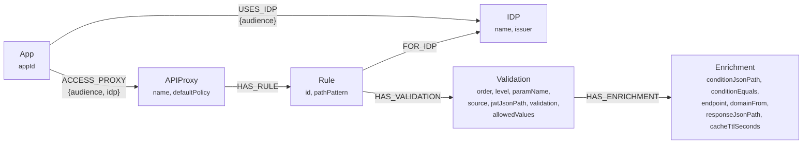
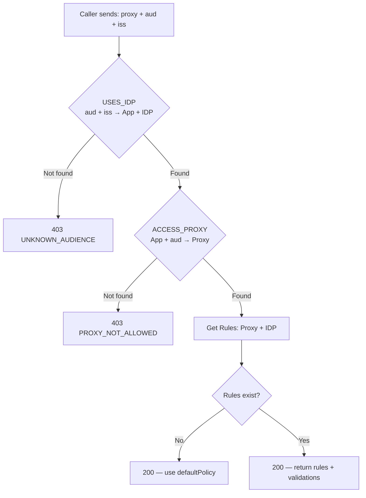

# nomos

This project uses Quarkus, the Supersonic Subatomic Java Framework.

If you want to learn more about Quarkus, please visit its website: <https://quarkus.io/>.

## Running the application in dev mode

You can run your application in dev mode that enables live coding using:

```shell script
./mvnw quarkus:dev
```

> **_NOTE:_**  Quarkus now ships with a Dev UI, which is available in dev mode only at <http://localhost:8080/q/dev/>.

## Packaging and running the application

The application can be packaged using:

```shell script
./mvnw package
```

It produces the `quarkus-run.jar` file in the `target/quarkus-app/` directory.
Be aware that it’s not an _über-jar_ as the dependencies are copied into the `target/quarkus-app/lib/` directory.

The application is now runnable using `java -jar target/quarkus-app/quarkus-run.jar`.

If you want to build an _über-jar_, execute the following command:

```shell script
./mvnw package -Dquarkus.package.jar.type=uber-jar
```

The application, packaged as an _über-jar_, is now runnable using `java -jar target/*-runner.jar`.

## Creating a native executable

You can create a native executable using:

```shell script
./mvnw package -Dnative
```

Or, if you don't have GraalVM installed, you can run the native executable build in a container using:

```shell script
./mvnw package -Dnative -Dquarkus.native.container-build=true
```

You can then execute your native executable with: `./target/nomos-1.0.0-SNAPSHOT-runner`

If you want to learn more about building native executables, please consult <https://quarkus.io/guides/maven-tooling>.

## Related Guides

- Hibernate Validator ([guide](https://quarkus.io/guides/validation)): Bean validation using Hibernate Validator and Jakarta Validation annotations
- SmallRye OpenAPI ([guide](https://quarkus.io/guides/openapi-swaggerui)): Generate OpenAPI schemas and serve Swagger UI for REST API documentation
- REST Jackson ([guide](https://quarkus.io/guides/rest#json-serialisation)): Jackson serialization support for Quarkus REST. This extension is not compatible with the quarkus-resteasy extension, or any of the extensions that depend on it
- SmallRye Health ([guide](https://quarkus.io/guides/smallrye-health)): Monitor service health
- Kubernetes ([guide](https://quarkus.io/guides/kubernetes)): Generate Kubernetes resources from annotations

## Graph Model



### Resolution flow



> **Note:** Rules are defined per **proxy + IDP**, not per audience. Multiple audiences from the same IDP that can reach the same proxy will share the same rules. The audience controls *access* (can you reach the proxy?), the IDP controls *validation* (which jsonPaths apply). You define a rule once — all audiences that reach that proxy through that IDP use it.

## Admin API — Graph Management

Base path: `/nomos/v1/api/admin`

| # | Endpoint | Method | Body | Creates |
|---|----------|--------|------|---------|
| 1 | `/idp` | POST | `{ "name": "auth0", "issuer": "https://auth0.example.com" }` | IDP node |
| 2 | `/app` | POST | `{ "appId": "mobile-app-br" }` | App node |
| 3 | `/app/{appId}/idp/{idpName}` | POST | `{ "audience": "client_id_123", "label": "Mobile BR Production" }` | USES_IDP relationship (App → IDP) |
| 4 | `/proxy` | POST | `{ "name": "account-service", "defaultPolicy": "deny" }` | APIProxy node |
| 5 | `/access` | POST | `{ "appId": "mobile-app-br", "proxyName": "account-service", "audience": "client_id_123", "idpName": "auth0" }` | ACCESS_PROXY relationship (App → Proxy) |
| 6 | `/rule` | POST | See below | Rule + Validations + Enrichments |
| 6b | `/rules` | POST | See below | Multiple Rules for same proxy+IDP (batch) |
| 7 | `/app/{appId}` | DELETE | — | Removes App + all relationships |
| 8 | `/app/{appId}/idp/{idpName}?aud={audience}` | DELETE | — | Removes audience + its proxy access |
| 9 | `/idp/{idpName}` | PUT | `{ "issuer": "https://new-issuer.example.com" }` | Updates IDP issuer |
| 10 | `/app/{appId}/idp/{idpName}?aud={audience}` | PUT | `{ "label": "New Label" }` | Updates audience label |

> **Required creation order:**
> ```
> 1. POST /admin/idp                          ← create IDP first
> 2. POST /admin/app                          ← create App
> 3. POST /admin/app/{appId}/idp/{idpName}    ← register audience (requires 1 + 2)
> 4. POST /admin/proxy                        ← create Proxy
> 5. POST /admin/access                       ← grant access (requires 2 + 3 + 4)
> 6. POST /admin/rule or /admin/rules         ← create rules (requires 1 + 4)
> ```
> Each step validates that the referenced entities exist. Skipping a step returns a clear error (404 or 400).

### Access creation — why audience is required

The same app can have different proxy access per audience. The `audience` on `ACCESS_PROXY` scopes which proxies are reachable with a specific token:

```json
POST /nomos/v1/api/admin/access
{
  "appId": "mobile-app-br",
  "proxyName": "account-service",
  "audience": "mobile-br-auth0-client",
  "idpName": "auth0"
}
```

```json
POST /nomos/v1/api/admin/access
{
  "appId": "mobile-app-br",
  "proxyName": "billing-service",
  "audience": "mobile-br-auth0-client",
  "idpName": "auth0"
}
```

```json
POST /nomos/v1/api/admin/access
{
  "appId": "mobile-app-br",
  "proxyName": "account-service",
  "audience": "mobile-br-kc-internal",
  "idpName": "keycloak"
}
```

Result: `mobile-app-br` with auth0 audience → reaches `account-service` + `billing-service`. Same app with keycloak audience → only reaches `account-service`. Different tokens, different access.

### Access without rules — using defaultPolicy

Not every proxy needs rules. If a proxy has `defaultPolicy: "allow"`, you can grant access without creating any rules. The middleware will resolve the proxy, see no rules, and use the defaultPolicy:

```json
POST /nomos/v1/api/admin/proxy
{ "name": "notification-service", "defaultPolicy": "allow" }

POST /nomos/v1/api/admin/access
{ "appId": "mobile-app-br", "proxyName": "notification-service", "audience": "mobile-br-auth0-client", "idpName": "auth0" }
```

At runtime:
```
GET /nomos/v1/api/rules?proxy=notification-service&aud=mobile-br-auth0-client&iss=https://auth0.example.com
```
```json
200 OK
{
  "proxy": "notification-service",
  "appId": "mobile-app-br",
  "idp": "auth0",
  "defaultPolicy": "allow",
  "rules": []
}
```

Empty rules + `defaultPolicy: "allow"` → the middleware lets everything through. No path validation, no jsonPath checks. Useful for services that don't need personification control.

### Rule creation example

```json
POST /nomos/v1/api/admin/rule
{
  "proxyName": "account-service",
  "idpName": "auth0",
  "pathPattern": "/{country}/accounts/{msisdn}/balance",
  "methods": ["GET"],
  "validations": [
    {
      "order": 1,
      "level": 1,
      "paramName": "country",
      "source": "path",
      "jwtJsonPath": "$.country",
      "validation": "equals"
    },
    {
      "order": 2,
      "level": 2,
      "paramName": "msisdn",
      "source": "path",
      "jwtJsonPath": "$.aL",
      "validation": "contains",
      "enrichment": {
        "conditionJsonPath": "$.allAc",
        "conditionEquals": false,
        "endpoint": "/users/me",
        "domainFrom": "jwtIssuer",
        "responseJsonPath": "$.accountDetail.subscriptions[*].msisdn",
        "cacheTtlSeconds": 300
      }
    }
  ]
}
```

### Rule with query param validation

```json
POST /nomos/v1/api/admin/rule
{
  "proxyName": "billing-service",
  "idpName": "auth0",
  "pathPattern": "/billing/accounts",
  "methods": ["GET"],
  "validations": [
    {
      "order": 1,
      "level": 2,
      "paramName": "msisdn",
      "source": "query",
      "jwtJsonPath": "$.aL",
      "validation": "contains"
    },
    {
      "order": 2,
      "level": 1,
      "paramName": "type",
      "source": "query",
      "validation": "in",
      "allowedValues": ["personal", "business"]
    }
  ]
}
```

## Query API — Runtime Rule Resolution

Base path: `/nomos/v1/api/rules`

| Endpoint | Method | Description | Used by |
|----------|--------|-------------|---------|
| `?proxy={name}&aud={audience}&iss={issuer}` | GET | Full rule resolution for a proxy + audience + issuer | **Caller (middleware)** |

> **The only endpoint the caller middleware needs is `GET /nomos/v1/api/rules?proxy=...&aud=...&iss=...`**

### Admin Query Endpoints

Base path: `/nomos/v1/api/admin`

| Endpoint | Method | Description |
|----------|--------|-------------|
| `/audiences/{idpName}` | GET | List all known audiences for an IDP |
| `/audiences/search?label={text}` | GET | Search audiences by label (case-insensitive) |
| `/app/{appId}/audiences` | GET | List all audiences for a specific app |
| `/apps?aud={audience}&iss={issuer}` | GET | List apps associated with an audience and issuer |
| `/access/{appId}?aud={audience}` | GET | List proxies accessible by an app for a given audience |
| `/proxy/{proxyName}/apps` | GET | List apps that can access a proxy |

### Caller Reference — Requests and Responses

#### 1. Get audiences for an IDP

```
GET /nomos/v1/api/admin/audiences/auth0
```
```json
200 OK
["mobile-br-auth0-client", "mobile-co-auth0-client", "mobile-ar-auth0-client", "web-br-auth0-federated", "chatbot-auth0-client"]
```

#### 2. Get apps by audience + issuer

```
GET /nomos/v1/api/admin/apps?aud=mobile-br-auth0-client&iss=https%3A%2F%2Fauth0.example.com
```
```json
200 OK
["mobile-app-br"]
```

#### 3. Get proxies accessible by an app + audience

```
GET /nomos/v1/api/admin/access/mobile-app-br?aud=mobile-br-auth0-client
```
```json
200 OK
[
  { "proxy": "account-service", "defaultPolicy": "deny" },
  { "proxy": "billing-service", "defaultPolicy": "allow" },
  { "proxy": "payment-gateway", "defaultPolicy": "deny" }
]
```

#### 3b. With expand=rules (includes path patterns)

```
GET /nomos/v1/api/admin/access/mobile-app-br?aud=mobile-br-auth0-client&expand=rules
```
```json
200 OK
[
  {
    "proxy": "account-service",
    "defaultPolicy": "deny",
    "rules": [
      { "pathPattern": "/{country}/accounts/{msisdn}/balance", "methods": ["GET"] }
    ]
  },
  {
    "proxy": "billing-service",
    "defaultPolicy": "allow",
    "rules": []
  },
  {
    "proxy": "payment-gateway",
    "defaultPolicy": "deny",
    "rules": []
  }
]
```

#### 4. Get apps that can access a proxy

```
GET /nomos/v1/api/admin/proxy/account-service/apps
```
```json
200 OK
[
  { "appId": "mobile-app-br", "audience": "mobile-br-auth0-client", "idp": "auth0" },
  { "appId": "mobile-app-br", "audience": "mobile-br-kc-internal", "idp": "keycloak" },
  { "appId": "mobile-app-co", "audience": "mobile-co-auth0-client", "idp": "auth0" },
  { "appId": "internal-backoffice", "audience": "backoffice-kc-client", "idp": "keycloak" }
]
```

> **Why audience + issuer?** The same audience string can exist across different IDPs.
> For example, both auth0 and keycloak could issue tokens with `aud: "mobile-client"`.
> Without the issuer, you can't tell them apart:
>
> ```
> GET /nomos/v1/api/admin/apps?aud=mobile-client&iss=https://auth0.example.com
> → ["mobile-app-br"]
>
> GET /nomos/v1/api/admin/apps?aud=mobile-client&iss=https://keycloak.internal.com/realms/main
> → ["internal-backoffice"]
> ```
>
> Same audience, different issuers → different apps, different proxy access.
> The `iss` (issuer from the JWT) is the discriminator that avoids name collision.

#### 5. Full rule resolution (main runtime call)

```
GET /nomos/v1/api/rules?proxy=account-service&aud=mobile-br-auth0-client&iss=https%3A%2F%2Fauth0.example.com
```
```json
200 OK
{
  "proxy": "account-service",
  "appId": "mobile-app-br",
  "idp": "auth0",
  "defaultPolicy": "deny",
  "rules": [
    {
      "id": "rule-acct-auth0-001",
      "pathPattern": "/{country}/accounts/{msisdn}/balance",
      "methods": ["GET"],
      "validations": [
        {
          "order": 1,
          "level": 1,
          "paramName": "country",
          "source": "path",
          "jwtJsonPath": "$.country",
          "validation": "equals",
          "enrichment": null
        },
        {
          "order": 2,
          "level": 2,
          "paramName": "msisdn",
          "source": "path",
          "jwtJsonPath": "$.aL",
          "validation": "contains",
          "enrichment": {
            "condition": { "jwtJsonPath": "$.allAc", "equals": false },
            "endpoint": "/users/me",
            "domainFrom": "jwtIssuer",
            "responseJsonPath": "$.accountDetail.subscriptions[*].msisdn",
            "cacheTtlSeconds": 300
          }
        }
      ]
    }
  ]
}
```

#### Error responses

| Scenario | HTTP | Response |
|----------|------|----------|
| Unknown audience (aud+iss not registered) | 403 | `{ "error": "UNKNOWN_AUDIENCE", "message": "Audience 'xxx' is not registered" }` |
| Audience exists but can't reach this proxy | 403 | `{ "error": "PROXY_NOT_ALLOWED", "message": "Audience 'xxx' does not have access to proxy 'yyy'" }` |
| Rules resolved but none defined for this IDP | 200 | `{ ..., "defaultPolicy": "deny", "rules": [] }` — caller uses defaultPolicy |
| App not found (on link, access, or delete) | 404 | `{ "error": "APP_NOT_FOUND", "message": "App 'xxx' does not exist" }` |
| IDP not found (on link or rule creation) | 404 | `{ "error": "IDP_NOT_FOUND", "message": "IDP 'xxx' does not exist" }` |
| Proxy not found (on access or rule creation) | 404 | `{ "error": "PROXY_NOT_FOUND", "message": "Proxy 'xxx' does not exist" }` |
| Audience not registered for app (on access creation) | 400 | `{ "error": "AUDIENCE_NOT_REGISTERED", "message": "Audience 'xxx' is not registered for app 'yyy'" }` |

## Neo4j in Kubernetes — Considerations

- **Persistence:** Always back Neo4j data with a PersistentVolumeClaim (e.g., EBS gp3). Without a PVC, data is lost on pod restart.
- **Helm chart:** Use the official `neo4j/neo4j` Helm chart for StatefulSet, PVC, and configuration management.
- **Memory tuning:** Neo4j is memory-intensive. Set explicit `resources.requests/limits` and tune `dbms.memory.heap.max_size` and `dbms.memory.pagecache.size` in your Helm values.
- **Backup strategy:**
  - Nightly `neo4j-admin database dump` via a CronJob, pushing to S3.
  - Complement with EBS volume snapshots for point-in-time recovery.
  - Community Edition requires stopping writes during dump for full consistency.
- **High Availability:** Community Edition is single-instance only. Pod restarts cause brief downtime. For HA clustering, Enterprise Edition is required. For a rules engine with infrequent writes, single instance with fast restart is sufficient.
- **Network:** Expose Neo4j bolt protocol (port 7687) as a ClusterIP Service. Only nomos pods need to reach it — no external ingress required.

## Observability & Security Metrics

Since `nomos-oss` serves as the centralized policy registry and is queried synchronously by the `nomos-middleware` on the API Gateway path, robust observability is critical to prevent latency overhead and detect exploit probes.

### Top Priority Metrics

To guarantee performance and catch anomalous lookups while preventing metrics system degradation, `nomos-oss` implements the following top-priority metrics:

| Metric Name | Type | Description | Dimensions (Bounded) | Alerting Condition |
|-------------|------|-------------|------------|---------------------|
| `nomos_rule_resolution_latency_seconds` | Histogram | Latency of the `GET /nomos/v1/api/rules` endpoint called by the middleware. | `proxy`, `result` (`success`, `error`, `not_found`) | p99 $> 5\text{ms}$ over 1 minute |
| `nomos_rule_resolution_total` | Counter | Total volume of rule queries from the middleware. | `proxy`, `status` (`success`, `unauthorized`, `proxy_not_found`, `error`) | Alert on spike in `status="proxy_not_found"` or `status="unauthorized"` |
| `nomos_neo4j_query_latency_seconds` | Histogram | Database traversal and rule graph loading time. | `query_type` (`resolve_rules`, `search_audiences`) | p95 $> 15\text{ms}$ over 3 minutes |
| `nomos_local_cache_hit_ratio` | Gauge | Hit/miss efficiency ratio of the local L1 Caffeine cache. | `cache_name` | Hit ratio $< 85\%$ under high traffic |

> [!WARNING]
> **Preventing Metric Cardinality Explosion**
>
> Adding high-cardinality dimensions like `appId`, `audience`, or `client_ip` to Prometheus/OpenTelemetry metrics can easily generate millions of unique time series, crashing Prometheus (OOM) and causing major dashboards to fail. 
> 
> **Enterprise Best Practice:** 
> 1. Keep metrics strictly **bounded** using low-cardinality labels (such as `proxy` and `status`).
> 2. Offload high-cardinality details (`appId`, `audience`, `client_ip`, and `reason`) to **Structured JSON Logs** to be ingested by indexing engines like Loki, Elasticsearch, or Datadog Logs.
> 3. Use **OpenTelemetry Trace / Exemplar IDs** in Grafana to jump directly from a metrics latency/failure spike to the exact log/trace containing the malicious audience.

### Security Mitigation via Metrics & Logs

Monitoring anomalous trends in these metrics combined with log correlation can instantly identify and mitigate:
1. **BOLA & ID Harvesting Probes:** High rates of `nomos_rule_resolution_total` with `status="unauthorized"` indicates client credentials attempting to access unauthorized proxy boundaries. Cross-reference the timestamp with your JSON logs to extract the exact offending `audience` and block it at the gateway.
2. **Shadow Service Exposure:** Spikes in `status="proxy_not_found"` suggest traffic is routed to services that do not have rule graphs registered in Nomos.
3. **Internal Cache Eviction Floods:** Dropping `nomos_local_cache_hit_ratio` warns of cache thrashing which cascades into higher Neo4j CPU loads and database latency spikes.
