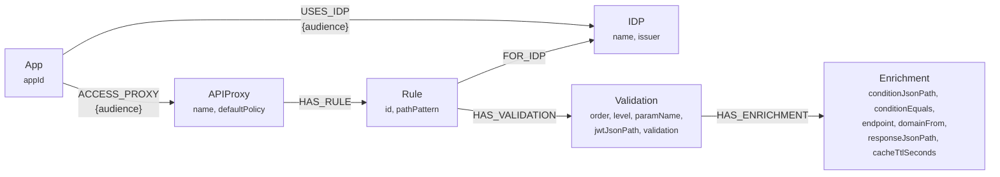
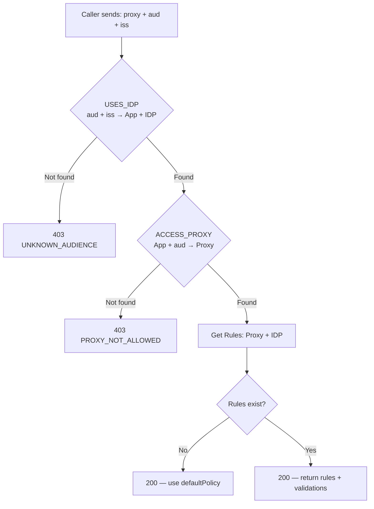

# nomos

This project uses Quarkus, the Supersonic Subatomic Java Framework.

If you want to learn more about Quarkus, please visit its website: <https://quarkus.io/>.

## 📚 Architecture & Integration Guides

This repository contains comprehensive documentation detailing the design, architecture, integration options, and deployment strategies for Nomos:

* **[Implementation Plan & Architecture](plans.md)**: Problem statement, high-level architecture diagram, REST API specification, and detailed validation logic.
* **[Graph Model & Query API](graph-model.md)**: Visual representation of the Neo4j graph schema and runtime rule resolution flow.
* **[Fastify Middleware Caller Example](caller-example.md)**: A complete, fast reference implementation using Fastify and Redis caching to fetch and evaluate Nomos rules.
* **[Istio External Authorization Integration](steps-for-ext-authz-istio.md)**: Complete step-by-step instructions to integrate Nomos with Istio Service Mesh (`ext_authz`), comparing sidecar vs centralized approaches.
* **[Neo4j Kubernetes Deployment Guide](neo4j-k8s/README.md)**: Helm-based deployment instructions, StatefulSet configuration, memory tuning, and CronJob-based S3 backups for Neo4j.

## Running the application in dev mode

You can run your application in dev mode that enables live coding using:

```shell script
./mvnw quarkus:dev
```

> **_NOTE:_**  Quarkus now ships with a Dev UI, which is available in dev mode only at <http://localhost:8080/q/dev/>.

## Packaging and running the application

The application can be packaged using:

```shell script
./mvnw package
```

It produces the `quarkus-run.jar` file in the `target/quarkus-app/` directory.
Be aware that it’s not an _über-jar_ as the dependencies are copied into the `target/quarkus-app/lib/` directory.

The application is now runnable using `java -jar target/quarkus-app/quarkus-run.jar`.

If you want to build an _über-jar_, execute the following command:

```shell script
./mvnw package -Dquarkus.package.jar.type=uber-jar
```

The application, packaged as an _über-jar_, is now runnable using `java -jar target/*-runner.jar`.

## Creating a native executable

You can create a native executable using:

```shell script
./mvnw package -Dnative
```

Or, if you don't have GraalVM installed, you can run the native executable build in a container using:

```shell script
./mvnw package -Dnative -Dquarkus.native.container-build=true
```

You can then execute your native executable with: `./target/nomos-1.0.0-SNAPSHOT-runner`

If you want to learn more about building native executables, please consult <https://quarkus.io/guides/maven-tooling>.

## Related Guides

- Hibernate Validator ([guide](https://quarkus.io/guides/validation)): Bean validation using Hibernate Validator and Jakarta Validation annotations
- SmallRye OpenAPI ([guide](https://quarkus.io/guides/openapi-swaggerui)): Generate OpenAPI schemas and serve Swagger UI for REST API documentation
- REST Jackson ([guide](https://quarkus.io/guides/rest#json-serialisation)): Jackson serialization support for Quarkus REST. This extension is not compatible with the quarkus-resteasy extension, or any of the extensions that depend on it
- SmallRye Health ([guide](https://quarkus.io/guides/smallrye-health)): Monitor service health
- Kubernetes ([guide](https://quarkus.io/guides/kubernetes)): Generate Kubernetes resources from annotations

## Graph Model



### Resolution flow



## Admin API — Graph Management

Base path: `/api/v1/admin`

| # | Endpoint | Method | Body | Creates |
|---|----------|--------|------|---------|
| 1 | `/idp` | POST | `{ "name": "auth0", "issuer": "https://auth0.example.com" }` | IDP node |
| 2 | `/app` | POST | `{ "appId": "mobile-app-br" }` | App node |
| 3 | `/app/{appId}/idp/{idpName}` | POST | `{ "audience": "client_id_123" }` | USES_IDP relationship (App → IDP) |
| 4 | `/proxy` | POST | `{ "name": "account-service", "defaultPolicy": "deny" }` | APIProxy node |
| 5 | `/access` | POST | `{ "appId": "mobile-app-br", "proxyName": "account-service", "audience": "client_id_123" }` | ACCESS_PROXY relationship (App → Proxy) |
| 6 | `/rule` | POST | See below | Rule + Validations + Enrichments |

### Rule creation example

```json
POST /api/v1/admin/rule
{
  "proxyName": "account-service",
  "idpName": "auth0",
  "pathPattern": "/{country}/accounts/{msisdn}/balance",
  "methods": ["GET"],
  "validations": [
    {
      "order": 1,
      "level": 1,
      "paramName": "country",
      "jwtJsonPath": "$.country",
      "validation": "equals"
    },
    {
      "order": 2,
      "level": 2,
      "paramName": "msisdn",
      "jwtJsonPath": "$.aL",
      "validation": "contains",
      "enrichment": {
        "conditionJsonPath": "$.allAc",
        "conditionEquals": false,
        "endpoint": "/users/me",
        "domainFrom": "jwtIssuer",
        "responseJsonPath": "$.accountDetail.subscriptions.subscriptionList[*].msisdn",
        "cacheTtlSeconds": 300
      }
    }
  ]
}
```

## Query API — Runtime Rule Resolution

Base path: `/api/v1/rules`

| Endpoint | Method | Description | Used by |
|----------|--------|-------------|---------|
| `?proxy={name}&aud={audience}&iss={issuer}&method={HTTP_METHOD}` | GET | Full rule resolution for a proxy + audience + issuer + HTTP method | **Caller (middleware)** |

> **The only endpoint the caller middleware needs is `GET /api/v1/rules?proxy=...&aud=...&iss=...&method=...`**

### Admin Query Endpoints

Base path: `/api/v1/admin`

| Endpoint | Method | Description |
|----------|--------|-------------|
| `/audiences/{idpName}` | GET | List all known audiences for an IDP |
| `/app/{appId}/audiences` | GET | List all audiences for a specific app |
| `/apps?aud={audience}&iss={issuer}` | GET | List apps associated with an audience and issuer |
| `/access/{appId}?aud={audience}` | GET | List proxies accessible by an app for a given audience |
| `/proxy/{proxyName}/apps` | GET | List apps that can access a proxy |

### Caller Reference — Requests and Responses

#### 1. Get audiences for an IDP

```
GET /api/v1/admin/audiences/auth0
```
```json
200 OK
["mobile-br-auth0-client", "mobile-co-auth0-client", "mobile-ar-auth0-client", "web-br-auth0-federated", "chatbot-auth0-client"]
```

#### 2. Get apps by audience + issuer

```
GET /api/v1/admin/apps?aud=mobile-br-auth0-client&iss=https%3A%2F%2Fauth0.example.com
```
```json
200 OK
["mobile-app-br"]
```

#### 3. Get proxies accessible by an app + audience

```
GET /api/v1/admin/access/mobile-app-br?aud=mobile-br-auth0-client
```
```json
200 OK
[
  { "proxy": "account-service", "defaultPolicy": "deny" },
  { "proxy": "billing-service", "defaultPolicy": "allow" },
  { "proxy": "payment-gateway", "defaultPolicy": "deny" }
]
```

#### 4. Get apps that can access a proxy

```
GET /api/v1/admin/proxy/account-service/apps
```
```json
200 OK
[
  { "appId": "mobile-app-br", "audience": "mobile-br-auth0-client" },
  { "appId": "mobile-app-br", "audience": "mobile-br-kc-internal" },
  { "appId": "mobile-app-co", "audience": "mobile-co-auth0-client" },
  { "appId": "internal-backoffice", "audience": "backoffice-kc-client" }
]
```

#### 5. Full rule resolution (main runtime call)

```
GET /api/v1/rules?proxy=account-service&aud=mobile-br-auth0-client&iss=https%3A%2F%2Fauth0.example.com&method=GET
```
```json
200 OK
{
  "proxy": "account-service",
  "appId": "mobile-app-br",
  "idp": "auth0",
  "defaultPolicy": "deny",
  "rules": [
    {
      "id": "rule-acct-auth0-001",
      "pathPattern": "/{country}/accounts/{msisdn}/balance",
      "methods": ["GET"],
      "validations": [
        {
          "order": 1,
          "level": 1,
          "paramName": "country",
          "jwtJsonPath": "$.country",
          "validation": "equals",
          "enrichment": null
        },
        {
          "order": 2,
          "level": 2,
          "paramName": "msisdn",
          "jwtJsonPath": "$.aL",
          "validation": "contains",
          "enrichment": {
            "condition": { "jwtJsonPath": "$.allAc", "equals": false },
            "endpoint": "/users/me",
            "domainFrom": "jwtIssuer",
            "responseJsonPath": "$.accountDetail.subscriptions[*].msisdn",
            "cacheTtlSeconds": 300
          }
        }
      ]
    }
  ]
}
```

#### Error responses

| Scenario | HTTP | Response |
|----------|------|----------|
| Unknown audience (aud+iss not registered) | 403 | `{ "error": "UNKNOWN_AUDIENCE", "message": "Audience 'xxx' is not registered" }` |
| Audience exists but can't reach this proxy | 403 | `{ "error": "PROXY_NOT_ALLOWED", "message": "Audience 'xxx' does not have access to proxy 'yyy'" }` |
| Rules resolved but none defined for this IDP | 200 | `{ ..., "defaultPolicy": "deny", "rules": [] }` — caller uses defaultPolicy |

## Neo4j in Kubernetes — Considerations

- **Persistence:** Always back Neo4j data with a PersistentVolumeClaim (e.g., EBS gp3). Without a PVC, data is lost on pod restart.
- **Helm chart:** Use the official `neo4j/neo4j` Helm chart for StatefulSet, PVC, and configuration management.
- **Memory tuning:** Neo4j is memory-intensive. Set explicit `resources.requests/limits` and tune `dbms.memory.heap.max_size` and `dbms.memory.pagecache.size` in your Helm values.
- **Backup strategy:**
  - Nightly `neo4j-admin database dump` via a CronJob, pushing to S3.
  - Complement with EBS volume snapshots for point-in-time recovery.
  - Community Edition requires stopping writes during dump for full consistency.
- **High Availability:** Community Edition is single-instance only. Pod restarts cause brief downtime. For HA clustering, Enterprise Edition is required. For a rules engine with infrequent writes, single instance with fast restart is sufficient.
- **Network:** Expose Neo4j bolt protocol (port 7687) as a ClusterIP Service. Only nomos pods need to reach it — no external ingress required.
