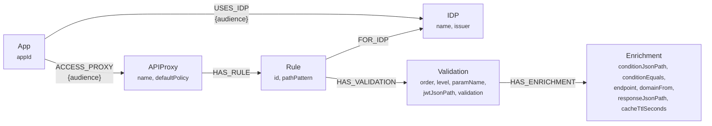
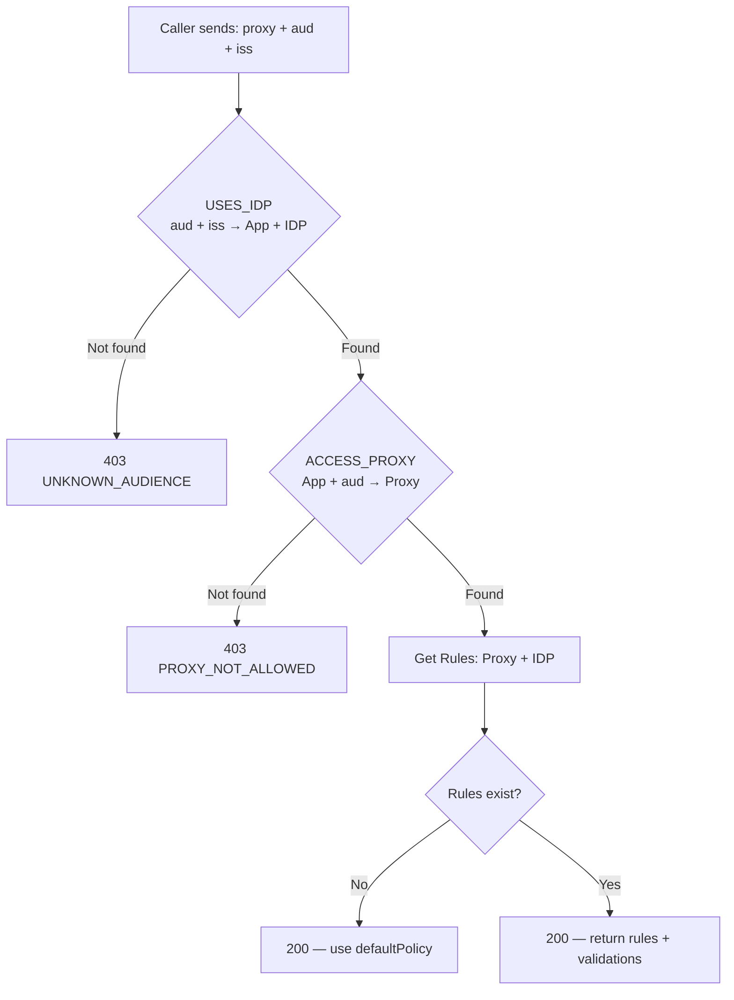

# nomos

A graph-based authorization rules engine built with Quarkus and Neo4j. It resolves runtime access rules by traversing a graph of Identity Providers, Applications, API Proxies, and validation rules with JSONPath expressions.

## Graph Model



## Resolution Flow



## How It Works

1. **IDP** — Represents an Identity Provider that issues JWTs (e.g., Auth0, Keycloak)
2. **App** — An application registered in the mesh
3. **USES_IDP** — Links an App to an IDP with a specific `audience` (the token's `aud` claim)
4. **ACCESS_PROXY** — Grants an App access to an API Proxy, scoped by `audience`
5. **Rule** — A path pattern that requires validation, attached to a Proxy and scoped to an IDP
6. **Validation** — How to check a path parameter against a JWT claim using JSONPath
7. **Enrichment** — Optional external call when the JWT doesn't contain the full data

## Admin API — Graph Management

Base path: `/api/v1/admin`

| # | Endpoint | Method | Description |
|---|----------|--------|-------------|
| 1 | `/idp` | POST | Create an IDP node |
| 2 | `/app` | POST | Create an App node |
| 3 | `/app/{appId}/idp/{idpName}` | POST | Link App to IDP with audience |
| 4 | `/proxy` | POST | Create an APIProxy node |
| 5 | `/access` | POST | Grant proxy access for an app+audience |
| 6 | `/rule` | POST | Create a Rule with Validations and Enrichments |

## Query API — Runtime Rule Resolution

Base path: `/api/v1/rules`

| Endpoint | Method | Description |
|----------|--------|-------------|
| `?proxy={name}&aud={audience}&iss={issuer}` | GET | Full rule resolution (used by caller middleware) |
| `/audiences/{idpName}` | GET | List all known audiences for an IDP |
| `/apps?aud={audience}&iss={issuer}` | GET | List apps for an audience+issuer |
| `/access/{appId}?aud={audience}` | GET | List proxies accessible by an app+audience |

> **The only endpoint the caller middleware needs is `GET /api/v1/rules?proxy=...&aud=...&iss=...`**

## Example Response (Rule Resolution)

```json
{
  "proxy": "account-service",
  "appId": "my-app",
  "idp": "my-idp",
  "defaultPolicy": "deny",
  "rules": [
    {
      "id": "uuid-here",
      "pathPattern": "/{country}/accounts/{msisdn}/balance",
      "validations": [
        {
          "order": 1,
          "level": 1,
          "paramName": "country",
          "jwtJsonPath": "$.country",
          "validation": "equals",
          "enrichment": null
        },
        {
          "order": 2,
          "level": 2,
          "paramName": "msisdn",
          "jwtJsonPath": "$.accountList",
          "validation": "contains",
          "enrichment": {
            "condition": { "jwtJsonPath": "$.allAccounts", "equals": false },
            "endpoint": "/users/me",
            "domainFrom": "jwtIssuer",
            "responseJsonPath": "$.subscriptions[*].msisdn",
            "cacheTtlSeconds": 300
          }
        }
      ]
    }
  ]
}
```

## Running

```shell
./mvnw quarkus:dev
```

Requires a Neo4j instance (see `docker-compose.yml`).

## Tech Stack

- Quarkus (Java 21)
- Neo4j (graph database)
- JAX-RS / Jakarta REST
- SmallRye OpenAPI (Swagger UI at `/q/dev/`)
