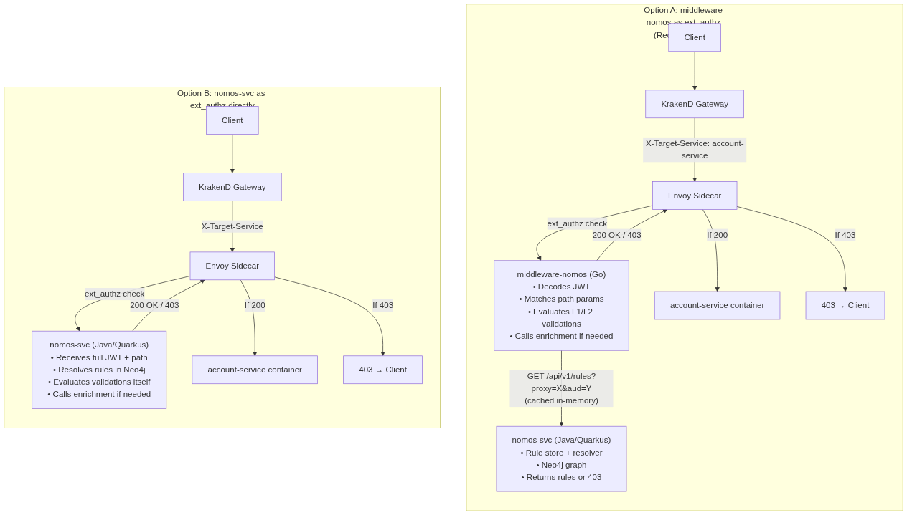

# Steps for Istio External Authorization Integration (ext_authz)

This guide outlines how to integrate the **Nomos Rules Engine** with **Istio Service Mesh** using an external authorization middleware (**`middleware-nomos`**) to protect downstream microservices (e.g., `account-service`).

---

## Architecture Options



### Option A: middleware-nomos as ext_authz (Recommended)

```
Client → KrakenD → Envoy → middleware-nomos (Go) → nomos-svc (Java/Quarkus) → Neo4j
                              ↓                         ↓
                        Does the hard job:         Rule store only:
                        • Decode JWT               • Resolves aud → app → proxy
                        • Match path params        • Returns rules or 403
                        • Evaluate L1/L2           • Never sees JWT claims
                        • Call enrichment
                        • Cache rules
```

### Option B: nomos-svc as ext_authz directly

```
Client → KrakenD → Envoy → nomos-svc (Java/Quarkus) → Neo4j
                              ↓
                        Does everything:
                        • Receives full JWT + path
                        • Resolves rules in Neo4j
                        • Evaluates validations
                        • Calls enrichment
                        • Single service
```

### Comparison

| Criteria | Option A (middleware-nomos + nomos-svc) | Option B (nomos-svc only) |
|----------|----------------------------------------|--------------------------|
| **Latency** | Low — rules cached in middleware, Neo4j only on cache miss | Higher — every check hits Neo4j (or needs internal cache) |
| **Scalability** | middleware-nomos scales independently, stateless | nomos-svc becomes hot path, must scale with traffic |
| **Separation of concerns** | ✅ Rule store vs rule evaluation are separate | ❌ One service does everything |
| **Language for hot path** | Go (fast, low memory, ideal for sidecar) | Java (heavier, GraalVM native helps) |
| **Enrichment calls** | Middleware handles it, close to the pod | nomos-svc must call external APIs |
| **Deployment** | 2 services to deploy | 1 service to deploy |
| **Complexity** | More moving parts | Simpler deployment |
| **Recommendation** | ✅ Production — Go middleware in hot path, Java for CRUD/admin | For prototyping/validation only |

### Decision

**Option A** — `middleware-nomos` (Go) as the ext_authz provider, `nomos-svc` (Java/Quarkus) as the rule store.

- Validate with Java first (current Quarkus implementation)
- Implement `middleware-nomos` in Go for production (low latency, small footprint, sidecar-friendly)

---

## Confirmed: Istio supports this via `CUSTOM` action + `envoyExtAuthzHttp`

Source: [Istio External Authorization (v1.30)](https://istio.io/latest/docs/tasks/security/authorization/authz-custom/)

Istio natively supports delegating access control to an external authorization service using:

1. **Extension Provider** in `meshConfig` — registers your service as an ext_authz HTTP provider
2. **AuthorizationPolicy** with `action: CUSTOM` — tells Envoy to call your provider before allowing traffic

### What we need in `meshConfig` (register middleware-nomos):

```yaml
data:
  mesh: |-
    extensionProviders:
    - name: "middleware-nomos-provider"
      envoyExtAuthzHttp:
        service: "middleware-nomos.default.svc.cluster.local"
        port: "8080"
        pathPrefix: "/check"
        includeRequestHeadersInCheck:
        - "authorization"
        - "x-target-service"
        headersToUpstreamOnAllow:
        - "x-nomos-authorization"
        - "x-nomos-app-id"
```

### What we need as `AuthorizationPolicy` (apply to target pods):

```yaml
apiVersion: security.istio.io/v1
kind: AuthorizationPolicy
metadata:
  name: ext-auth-by-nomos
  namespace: default
spec:
  selector:
    matchLabels:
      app: account-service
  action: CUSTOM
  provider:
    name: "middleware-nomos-provider"
  rules:
  - to:
    - operation:
        paths: ["/*"]
```

### How it works (from Istio docs):

> At runtime, requests matching the rules in the policy will be paused by the `ext_authz` filter, and a check request will be sent to the external authorizer to decide whether the request should be allowed or denied.

- `middleware-nomos` receives the check request with `authorization` header + `x-target-service`
- Returns `200 OK` → Envoy allows request to reach the pod
- Returns `403` → Envoy short-circuits, returns 403 directly to client

### Key points from Istio documentation:

- The provider type is `envoyExtAuthzHttp` (HTTP) or `envoyExtAuthzGrpc` (gRPC)
- `includeRequestHeadersInCheck` controls which headers Envoy forwards to the ext_authz service
- `headersToUpstreamOnAllow` lets middleware-nomos inject headers into the request going to the backend
- The `AuthorizationPolicy` `rules` field controls **when** to trigger the ext_authz check (you can scope by paths, methods, etc.)
- mTLS is supported between Envoy and the ext_authz service (spiffe identities)

### Headers options reference

#### What middleware-nomos RECEIVES (configurable in meshConfig)

```yaml
envoyExtAuthzHttp:
  service: "middleware-nomos.default.svc.cluster.local"
  port: "8080"
  pathPrefix: "/check"
  # Headers Envoy forwards TO middleware-nomos in the check request
  includeRequestHeadersInCheck:
  - "authorization"          # JWT token
  - "x-target-service"      # proxy name (from KrakenD)
```

Plus Envoy always sends (no config needed):
- `:path` — original request path (`/BR/accounts/5511999990000/balance`)
- `:method` — original HTTP method (`GET`)
- `:authority` — destination host (`account-service.default.svc:8080`)
- `x-forwarded-for` — client IP
- `x-request-id` — trace ID

#### What middleware-nomos RETURNS on ALLOW (headers injected to backend pod)

```yaml
  # Headers that reach the backend service when request is allowed
  headersToUpstreamOnAllow:
  - "x-nomos-app-id"         # which app was authorized
  - "x-nomos-idp"            # which IDP issued the token
  - "authorization"          # pass the JWT through to backend
```

middleware-nomos sets these in the 200 response:
```
HTTP/1.1 200 OK
X-Nomos-App-Id: mobile-app-br
X-Nomos-Idp: auth0
```

Backend pod receives them as request headers.

#### What middleware-nomos RETURNS on DENY (headers sent back to client)

```yaml
  # Headers sent back to the client when request is denied
  headersToDownstreamOnDeny:
  - "content-type"           # so client can parse JSON error
  - "x-nomos-error"         # error code
  - "x-nomos-param"         # which param failed
```

middleware-nomos sets these in the 403 response:
```
HTTP/1.1 403 Forbidden
Content-Type: application/json
X-Nomos-Error: LEVEL1_FAILED
X-Nomos-Param: country

{"error":"LEVEL1_FAILED","message":"Country mismatch: path=BR, jwt=AR","param":"country"}
```

Client receives the full response body + headers.

#### What middleware-nomos RETURNS on ALLOW (headers sent back to client)

```yaml
  # Headers sent back to the client when request is allowed
  headersToDownstreamOnAllow:
  - "x-nomos-app-id"        # client can see which app identity was resolved
```

#### Complete meshConfig example

```yaml
data:
  mesh: |-
    extensionProviders:
    - name: "middleware-nomos-provider"
      envoyExtAuthzHttp:
        service: "middleware-nomos.default.svc.cluster.local"
        port: "8080"
        pathPrefix: "/check"
        includeRequestHeadersInCheck:
        - "authorization"
        - "x-target-service"
        headersToUpstreamOnAllow:
        - "x-nomos-app-id"
        - "x-nomos-idp"
        - "authorization"
        headersToDownstreamOnAllow:
        - "x-nomos-app-id"
        headersToDownstreamOnDeny:
        - "content-type"
        - "x-nomos-error"
        - "x-nomos-param"
```

#### Summary table

| Direction | Config key | Purpose | Example |
|-----------|-----------|---------|---------|
| Client → Envoy → middleware-nomos | `includeRequestHeadersInCheck` | Forward headers for authorization decision | `authorization`, `x-target-service` |
| middleware-nomos → Envoy → Backend | `headersToUpstreamOnAllow` | Inject context into backend request | `x-nomos-app-id`, `x-nomos-idp` |
| middleware-nomos → Envoy → Client (on allow) | `headersToDownstreamOnAllow` | Inform client of resolved identity | `x-nomos-app-id` |
| middleware-nomos → Envoy → Client (on deny) | `headersToDownstreamOnDeny` | Error details back to client | `content-type`, `x-nomos-error` |

### Validating the ext_authz integration

After applying the `AuthorizationPolicy`, verify it's working:

**1. Check the policy was applied correctly:**

```bash
# Verify the policy exists and is bound to the correct workload
kubectl get authorizationpolicy ext-auth-by-nomos -n default -o yaml

# Check for config errors
istioctl analyze -n default
```

**2. Enable debug logging on the Envoy sidecar:**

```bash
# Set authorization debug level on the target pod
istioctl proxy-config log <account-service-pod> --level ext_authz:debug,rbac:debug

# Stream the Envoy logs to see ext_authz calls
kubectl logs -f <account-service-pod> -c istio-proxy | grep ext_authz
```

**3. Test a request and verify it hits middleware-nomos:**

```bash
# From inside the mesh (another pod):
kubectl exec deploy/curl -- curl -v \
  -H "Authorization: Bearer <valid-jwt>" \
  -H "X-Target-Service: account-service" \
  http://account-service.default.svc.cluster.local:8080/BR/accounts/5511999990000/balance

# Expected: 200 if allowed, 403 if denied by middleware-nomos
```

**4. Check middleware-nomos logs to confirm it received the check:**

```bash
kubectl logs -f deploy/middleware-nomos | grep "/check"

# Should show:
# POST /check - headers received: authorization, x-target-service
# Nomos rules fetched for proxy=account-service, aud=client_id_123
# Validation result: ALLOWED (or DENIED)
```

**5. Verify deny scenario (send invalid/missing token):**

```bash
# No token → should be denied
kubectl exec deploy/curl -- curl -v \
  http://account-service.default.svc.cluster.local:8080/BR/accounts/5511999990000/balance

# Wrong audience → should be denied by Nomos (UNKNOWN_AUDIENCE)
kubectl exec deploy/curl -- curl -v \
  -H "Authorization: Bearer <jwt-with-wrong-aud>" \
  http://account-service.default.svc.cluster.local:8080/BR/accounts/5511999990000/balance
```

**6. Inspect Envoy stats for ext_authz metrics:**

```bash
# Check ext_authz filter stats
istioctl proxy-config stats <account-service-pod> | grep ext_authz

# Look for:
# ext_authz.ext_authz.ok         → requests allowed
# ext_authz.ext_authz.denied     → requests denied
# ext_authz.ext_authz.error      → middleware-nomos unreachable
# ext_authz.ext_authz.failure_mode_allowed → allowed on error (if configured)
```

**7. Dry-run mode (Istio v1.23+):**

You can test the policy without enforcing it using Istio's dry-run annotation:

```yaml
apiVersion: security.istio.io/v1
kind: AuthorizationPolicy
metadata:
  name: ext-auth-by-nomos
  namespace: default
  annotations:
    "istio.io/dry-run": "true"   # Log decisions but don't enforce
spec:
  selector:
    matchLabels:
      app: account-service
  action: CUSTOM
  provider:
    name: "middleware-nomos-provider"
  rules:
  - to:
    - operation:
        paths: ["/*"]
```

With dry-run enabled, Envoy logs the decision but always allows the request. Check the Envoy logs for `shadow denied` or `shadow allowed` to validate before enforcing.

---

## 1. Architectural Workflow

By leveraging KrakenD for simple routing/header injection, and Istio for Zero-Trust enforcement at the destination pods, the request lifecycle runs as follows:

```
Client ──► [KrakenD Gateway] (Stamps X-Target-Service: account-service)
                  │
                  ▼
         [account-service Pod]
                  │
                  ▼  (Inbound network interception)
         [Envoy Sidecar Proxy] ──► [middleware-nomos] (The Hard Job)
                  │                       │
                  │                       ├──► Fetches rules from Nomos REST API (and caches)
                  │                       ├──► Decodes JWT claims
                  │                       ├──► Matches path parameters
                  │                       ├──► Evaluates Level 1 & Level 2 check logic
                  │                       └──► Calls Enrichment fallback API if triggered
                  │
                  ├─── [If ALLOWED: 200 OK] ───► [account-service container (Port 8080)]
                  └─── [If DENIED:  403 Error] ──► (Short-circuits directly back to client)
```

---

## 2. Step 1: Configure KrakenD (Gateway)

KrakenD acts strictly as a router and stamps the outgoing request with the logical target service name. 

In your `krakend.json`:

```json
{
  "endpoint": "/BR/accounts/{msisdn}/balance",
  "method": "GET",
  "backend": [
    {
      "url_pattern": "/BR/accounts/{msisdn}/balance",
      "host": [
        "http://account-service.default.svc.cluster.local:8080"
      ]
    }
  ],
  "extra_config": {
    "headers_to_add": {
      "X-Target-Service": "account-service"
    }
  }
}
```

---

## 3. Step 2: Register Provider in Istio `meshConfig`

Tell Istio about your custom authorizer service (`middleware-nomos`). In the `istio-system` namespace, edit the global Istio ConfigMap (`kubectl edit cm istio -n istio-system`) and register the HTTP provider:

```yaml
data:
  mesh: |-
    extensionProviders:
    - name: "middleware-nomos-provider"
      httpService:
        service: "middleware-nomos.default.svc.cluster.local"
        port: "8080"
        pathPrefix: "/check"
        # CRITICAL: Instruct Envoy to forward these headers to your middleware
        includeRequestHeadersInCheck:
        - "x-target-service"
        - "authorization"
        - "x-original-method" # Sent automatically by Envoy, but good to ensure
```

---

## 4. Step 3: Apply `AuthorizationPolicy` to target Pods

Tell Istio to intercept traffic at the entry boundary of the target pod. 

Create `nomos-policy.yaml`:

```yaml
apiVersion: security.istio.io/v1beta1
kind: AuthorizationPolicy
metadata:
  name: ext-auth-by-nomos
  namespace: default
spec:
  selector:
    matchLabels:
      app: account-service # Apply to target pods matching this selector
  action: CUSTOM
  provider:
    name: "middleware-nomos-provider" # Must match meshConfig provider name
  rules:
  - to:
    - operation:
        methods: ["GET", "POST"]
        paths: ["/*"] # Intercept all inbound endpoints
```

---

## 5. Step 4: The Middleware Code (Doing "The Hard Job")

The `middleware-nomos` is a lightweight service that handles the heavy processing. Below is the production-ready logic (written in Node.js/Express) demonstrating how it extracts parameters, fetches rules, evaluates Level 1 and Level 2 policies, and calls external enrichment fallbacks:

```javascript
const express = require('express');
const axios = require('express');
const { jwtDecode } = require('jwt-decode');
const NodeCache = require('node-cache');

const app = express();
app.use(express.json());

// In-Memory cache for Rules Contracts and Enrichment responses
const rulesCache = new NodeCache({ stdTTL: 300 }); // Cache rules for 5 mins
const enrichmentCache = new NodeCache({ stdTTL: 120 }); // Cache API lookups for 2 mins

const NOMOS_SVC_URL = 'http://nomos-service.default.svc.cluster.local:8080';

// Helper: Matches an active URI against rule's pathPattern and extracts path variables
// e.g. path "/BR/accounts/551190000/balance" against pattern "/{country}/accounts/{msisdn}/balance"
// returns { country: "BR", msisdn: "551190000" }
function extractParams(pattern, actualPath) {
  const patternParts = pattern.split('/');
  const pathParts = actualPath.split('/');
  if (patternParts.length !== pathParts.length) return null;

  const params = {};
  for (let i = 0; i < patternParts.length; i++) {
    if (patternParts[i].startsWith('{') && patternParts[i].endsWith('}')) {
      const key = patternParts[i].slice(1, -1);
      params[key] = pathParts[i];
    } else if (patternParts[i] !== pathParts[i]) {
      return null; // Static segment mismatch
    }
  }
  return params;
}

// Helper: Query nested keys inside decoded JWT via JSONPath-like keys
// e.g. query(payload, "$.country")
function queryClaim(payload, jsonPath) {
  const path = jsonPath.replace('$.', '');
  return path.split('.').reduce((acc, part) => acc && acc[path], payload);
}

// Target check endpoint called by Envoy ext_authz
app.post('/check', async (req, res) => {
  try {
    // 1. Envoy passes headers. HTTP/2 normalizes keys to lowercase!
    const targetService = req.headers['x-target-service'];
    const authHeader = req.headers['authorization'];
    const originalPath = req.headers['x-original-uri'] || req.headers['x-original-path'] || req.path;
    const originalMethod = req.headers['x-original-method'] || req.method;

    if (!targetService) {
      return res.status(403).json({ error: "MISSING_X_TARGET_SERVICE_HEADER" });
    }
    if (!authHeader || !authHeader.startsWith('Bearer ')) {
      return res.status(401).json({ error: "MISSING_BEARER_TOKEN" });
    }

    const token = authHeader.split(' ')[1];
    let decodedJwt;
    try {
      decodedJwt = jwtDecode(token);
    } catch (e) {
      return res.status(401).json({ error: "INVALID_JWT_STRUCTURE" });
    }

    const audience = decodedJwt.aud;
    const issuer = decodedJwt.iss;

    // 2. Fetch Rules from Nomos Service (With in-memory caching)
    const requestMethod = req.method;
    const cacheKey = `${targetService}:${audience}:${requestMethod}`;
    let rulesData = rulesCache.get(cacheKey);

    if (!rulesData) {
      try {
        const nomosResponse = await axios.get(`${NOMOS_SVC_URL}/api/v1/rules`, {
          params: { proxy: targetService, aud: audience, iss: issuer, method: requestMethod }
        });
        rulesData = nomosResponse.data;
        rulesCache.set(cacheKey, rulesData);
      } catch (err) {
        // If Nomos returns a 403 (e.g. unknown audience or proxy not allowed), cascade it
        if (err.response && err.response.status === 403) {
          return res.status(403).json(err.response.data);
        }
        return res.status(500).json({ error: "NOMOS_CONNECTIVITY_ERROR", message: err.message });
      }
    }

    // Extract policy info
    const { defaultPolicy, rules = [] } = rulesData;

    // 3. Find matching Rule for the incoming HTTP path
    let matchedRule = null;
    let extractedParams = null;

    for (const rule of rules) {
      const params = extractParams(rule.pathPattern, originalPath);
      if (params) {
        matchedRule = rule;
        extractedParams = params;
        break;
      }
    }

    // No rule found -> evaluate fallback default gateway policy
    if (!matchedRule) {
      if (defaultPolicy === 'allow') {
        return res.status(200).send("Allowed by default proxy policy");
      }
      return res.status(403).json({ error: "NO_MATCHING_RULE", message: "Path pattern not covered under active policies" });
    }

    // 4. LEVEL 1 VALIDATION (Fail-Early, Country check)
    const level1Validations = (matchedRule.validations || []).filter(v => v.level === 1);
    for (const val of level1Validations) {
      const pathValue = extractedParams[val.paramName];
      const claimValue = queryClaim(decodedJwt, val.jwtJsonPath);

      if (val.validation === "equals" && pathValue !== claimValue) {
        return res.status(403).json({ error: "L1_COUNTRY_MISMATCH", message: `URL parameter '${pathValue}' does not match claim value` });
      }
      if (val.validation === "contains" && (!Array.isArray(claimValue) || !claimValue.includes(pathValue))) {
        return res.status(403).json({ error: "L1_COUNTRY_MISMATCH", message: `URL parameter '${pathValue}' not allowed in claims list` });
      }
    }

    // 5. LEVEL 2 VALIDATION (Deep Resource / Personification check)
    const level2Validations = (matchedRule.validations || []).filter(v => v.level === 2);
    for (const val of level2Validations) {
      const pathValue = extractedParams[val.paramName];
      let claimValue = queryClaim(decodedJwt, val.jwtJsonPath);

      // Check if Enrichment Fallback lookup is needed
      if (val.enrichment) {
        const condValue = queryClaim(decodedJwt, val.enrichment.conditionJsonPath);
        if (condValue === val.enrichment.conditionEquals) {
          // Check if enrichment response is already in local cache
          const enrichmentCacheKey = `${token}:${val.enrichment.endpoint}`;
          let enrichedData = enrichmentCache.get(enrichmentCacheKey);

          if (!enrichedData) {
            try {
              // Resolve domain dynamically based on rule configuration
              const domain = val.enrichment.domainFrom === 'jwtIssuer' ? issuer : NOMOS_SVC_URL;
              const enrichResponse = await axios.get(`${domain}${val.enrichment.endpoint}`, {
                headers: { 'Authorization': `Bearer ${token}` }
              });
              enrichedData = enrichResponse.data;
              enrichmentCache.set(enrichmentCacheKey, enrichedData, val.enrichment.cacheTtlSeconds);
            } catch (enrichErr) {
              return res.status(403).json({ error: "ENRICHMENT_FAILED", message: `Unable to enrich deep claims: ${enrichErr.message}` });
            }
          }
          // Extract allowed list from enrichment JSON path
          claimValue = queryClaim(enrichedData, val.enrichment.responseJsonPath);
        }
      }

      // Execute Level 2 validation match
      if (val.validation === "equals" && pathValue !== claimValue) {
        return res.status(403).json({ error: "L2_OWNERSHIP_VERIFICATION_FAILED" });
      }
      if (val.validation === "contains" && (!Array.isArray(claimValue) || !claimValue.includes(pathValue))) {
        return res.status(403).json({ error: "L2_OWNERSHIP_VERIFICATION_FAILED", message: `Target ownership verification failed` });
      }
    }

    // 6. ALL CHECKS PASSED -> ALLOW!
    res.setHeader('X-Nomos-Authorization', 'Success');
    return res.status(200).send("OK");

  } catch (err) {
    return res.status(500).json({ error: "INTERNAL_MIDDLEWARE_ERROR", details: err.message });
  }
});

app.listen(8080, () => console.log('Nomos ext_authz sidecar adapter listening on port 8080'));
```

---

## 6. Verification & Troubleshooting

To check that the filter is successfully interception and processing rules inside the mesh, stream sidecar authorization logs:

```bash
# Set sidecar logging to debug mode
istioctl admin log <your-account-service-pod-name> --level authorization:debug

# View Envoy logs
kubectl logs -f <your-account-service-pod-name> -c istio-proxy
```
